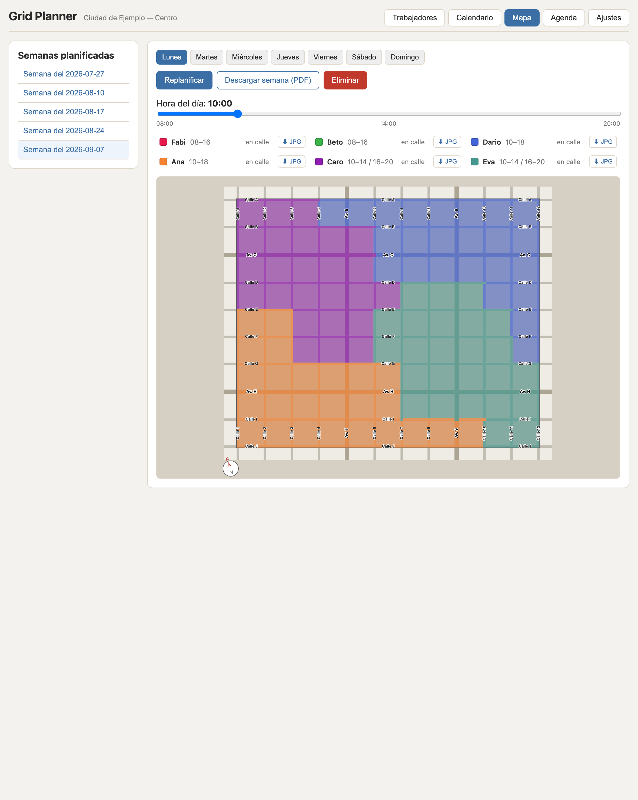
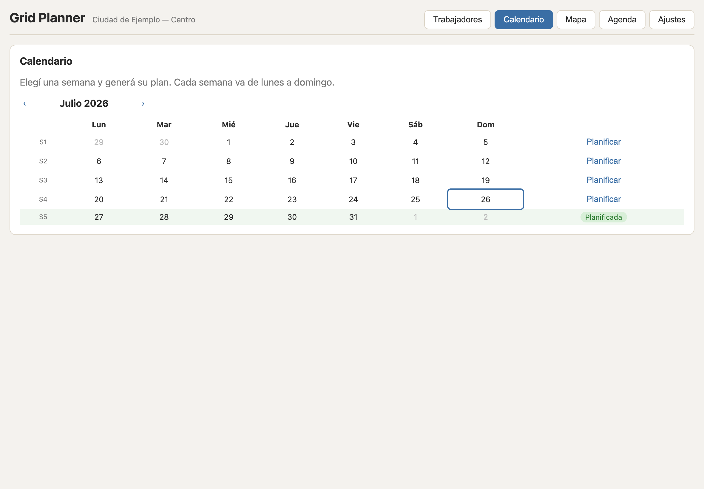
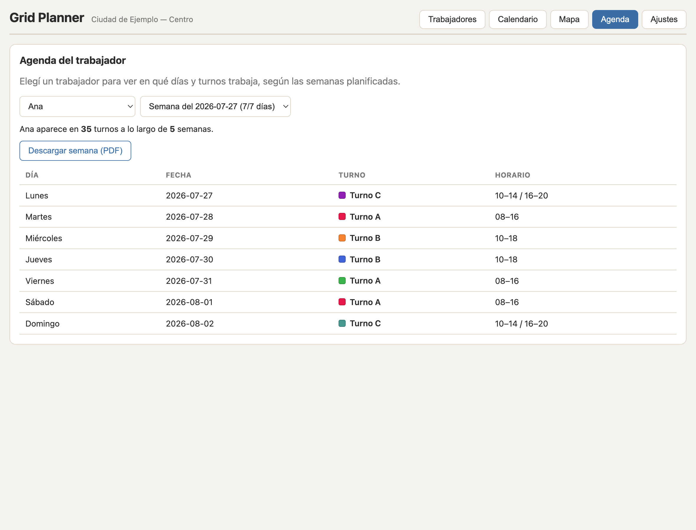

# Grid Planner

A small desktop tool for scheduling a team that has to **cover the streets of a
city's downtown grid**. Each week it splits the downtown into four fair,
contiguous zones, assigns workers to zones and shifts, draws an interactive
street map of who is where, and prints per-worker route sheets.

The whole application ships as a **single static binary**: a small Go web server
with the React frontend embedded inside it. There is nothing to install — no
runtime, no database engine. Data lives in one human-readable JSON file, and the
city itself is just a JSON map file, so the same binary works for any square-grid
downtown.

## Screenshots

Weekly plan on the interactive map — four contiguous zones, a time-of-day slider
showing who is *en calle* at each hour, and per-worker JPG export:



| Pick & plan a week | Per-worker weekly agenda |
| --- | --- |
|  |  |

*(The workers list — the roster you plan from — looks like [this](docs/screenshots/workers.png).)*

## Why this exists

This is a personal, non-commercial project. I built it in my spare time to help
a friend with a recurring headache at his company: fairly dividing a downtown
area into coverage zones and rostering people across shifts every week, which had
been a manual spreadsheet chore. It's shared here in case it's useful to someone
else with the same problem — there's no company, product, or support behind it.

## Features

- **Worker roster** — add/remove the people to be scheduled.
- **One-click weekly plans** — generate a full Monday–Sunday plan. The grid is
  split into four balanced, contiguous zones and workers are spread across three
  shifts; generation is deterministic per random seed, and *Replanificar*
  reshuffles for a different valid plan.
- **Intentionally unpredictable assignments** — the zone shapes and the
  worker-to-zone/shift assignments are deliberately re-randomised every week, so
  they can look irregular or "off" from one plan to the next. That is by design:
  coverage should not be predictable, so a worker can't anticipate (or game)
  where they'll be posted next week.
- **Always-covered centre** — the central district is guaranteed to be covered by
  two different people (two colours) at every hour of the day, including the thin
  single-shift windows.
- **Interactive street map** — pan/zoom, switch day, and drag a time-of-day
  slider to see exactly who is on the street at any hour. A compass toggle flips
  between a schematic view and true-north orientation.
- **Per-worker agenda** — pick a worker to see which days and shifts they work
  across all planned weeks.
- **Printable route sheets** — black-and-white, greyscale-safe map sheets (one
  per worker per day) exported as JPEG, or as a multi-page PDF for a whole week
  or a single worker's week.
- **Data-driven map** — streets, geometry and the central district come from a
  JSON file, so any city works (see [Custom maps](#custom-maps)); a map can also
  be baked into the binary per team.
- **Switchable data file** — choose where the JSON data lives from the Settings
  page, via a native OS file picker.
- **Spanish UI** — the interface is in Spanish (the operators it was built for
  are Spanish-speaking).

## Limitations

- **Square-grid cities only.** The planner and the map model a downtown as a
  rectangular grid of blocks. Diagonal avenues, curves, coastline/rivers and
  irregular blocks are **not** represented — a real city is approximated to the
  nearest grid. It fits the classic checkerboard downtown (common in
  Latin-American and Manhattan-style cities) and not much else. This was a
  deliberate scope decision, not an oversight: the city this tool was actually
  built for *is* a regular grid, so handling non-square layouts was never needed.
- **Fixed planning shape.** Four zones, six workers per day, three shifts. The
  rules are tuned for a grid roughly the size of the bundled example; very
  different grid sizes still produce a plan but may not hit every balance
  guarantee.
- **Single user, local.** No accounts, no multi-user sync, no server to host —
  it's meant to run on one machine (see below).

## Status & how it was built

This is a hobby-scale tool. It was **largely "vibe-coded"** — built quickly and
iteratively with an AI assistant — and is meant to **run locally**: you build
the binary and open it in your browser. Because it's not a hosted service and has
no team behind it, there is deliberately **no CI/CD** — no automated
test/build/deploy pipeline and no release automation. You build it with `make`
when you need it. The Go test suite (`make test`) covers the planning algorithm;
everything else is verified by running the app.

## Requirements

- **Go 1.26+**
- **Node.js + npm** (to build the frontend)

## Build & run

All targets run from the project root:

```sh
make build     # build the frontend, embed it, compile a binary for this machine
make run       # build everything and launch it
make all       # cross-compile release binaries (Windows/macOS/Linux) into bin/
make test      # run the Go test suite
make clean     # remove build artifacts
```

If `go` is not on your `PATH`, point the Makefile at it:

```sh
make build GO=$HOME/go-sdk/go/bin/go
```

The binary picks a free port, prints the URL, and opens your browser. Set `PORT`
to pin it (e.g. `PORT=8000 ./bin/GridPlanner`).

## Custom maps

The street grid is a JSON file. The app decides which map to use in this order:

1. the path in the `MAP_CONFIG` environment variable, if set;
2. a `map.json` next to the running binary (its working directory);
3. a `map.json` in the application-data directory;
4. the built-in example map (embedded), if none of the above exist.

To use your own city, copy [`map.example.json`](map.example.json), edit it, and
load it:

```sh
MAP_CONFIG=/path/to/your/map.json ./bin/GridPlanner
```

### Creating a map for your city (with an AI assistant)

You don't have to write the JSON by hand. The fastest way to map a new downtown:

1. Open the area in **Google Maps** and take a few **screenshots** at different
   zoom levels — enough to read the street names and see the block grid.
2. Hand those screenshots to an **AI assistant** (Claude, ChatGPT, etc.) together
   with [`map.example.json`](map.example.json) as the format to follow, and ask
   it to produce a `map.json` for that area: list the horizontal (west–east) and
   vertical (north–south) streets in order, mark which ones are avenues, set a
   sensible `label`, and choose a central district.
3. Save the result as `map.json` (or point `MAP_CONFIG` at it) and refine by eye
   against the rendered map.

Because the model is a **simplified square grid**, the AI only has to approximate
the real layout to the nearest grid — exact geometry, diagonals and curves don't
need to be reproduced.

### Map file schema

```jsonc
{
  "label": "My City — Downtown",     // shown as the subtitle in the UI
  "geometry": {                       // drawing constants (pixels/degrees)
    "BW": 70, "BH": 70,               // block width / height
    "SW": 7,  "AVW": 12,              // street width / avenue width
    "HALF": 35,                       // half-block ring thickness
    "MT": 28, "ML": 28,               // margins: top / left
    "MR": 28, "MB": 52,               // margins: right / bottom
    "ANGLE": 20                       // grid bearing vs. true north (deg CW)
  },
  "central": {                        // the always-prioritised central district,
    "columns": [2, 3, 4, 5, 6, 7, 8], // by block column index (0-based)
    "rows":    [3, 4, 5]              // by block row index (0-based)
  },
  "horizontal_streets": [             // west-east streets, north to south
    { "name": "Calle A", "av": false },
    { "name": "Av. C",   "av": true  }
    // ...
  ],
  "vertical_streets": [               // north-south streets, west to east
    { "name": "Calle 1", "av": false }
    // ...
  ]
}
```

Notes:

- The block grid is `(vertical_streets − 1)` columns by
  `(horizontal_streets − 1)` rows. The planner splits those blocks into four
  balanced, contiguous zones and keeps the `central` district covered by two
  zones at every hour, so `central` indices must fall inside the grid.
- `av: true` draws a street as a wider avenue.
- Keep the grid roughly the size of the example; see [Limitations](#limitations).

### Per-team builds (baking a map into the binary)

To hand a team a single self-contained executable with their city already
inside it, bake a map at build time with `MAP=` (and name the binary with
`APP=`):

```sh
# one binary for this machine
make build MAP=maps/teamA.json APP=Coverage-TeamA

# cross-compiled release binaries (Windows/macOS/Linux) for one team
make all   MAP=maps/teamB.json APP=Coverage-TeamB
```

`MAP` temporarily replaces the embedded example for that build only — the
committed example map is restored afterwards, so the working tree stays clean.
Without `MAP`, the built-in generic example is embedded. A baked binary can
still be pointed at a different map at runtime via `MAP_CONFIG` or a `map.json`
beside it, so the embedded map is just the default.

## Project layout

```
.
├── Makefile            # build / cross-compile (run from here)
├── map.example.json    # example map file (copy, edit, and load your own)
├── docs/screenshots/   # images used in this README
├── bin/                # compiled binaries (gitignored)
├── backend/            # Go module `gridplanner`
│   ├── main.go         # entry point: loads the map, starts the server
│   └── internal/
│       ├── api/        # HTTP handlers + static SPA serving (thin adapter)
│       ├── service/    # business logic (planning, DB switching) — the core
│       ├── store/      # JSON-file persistence
│       ├── planner/    # zone/shift assignment algorithm
│       ├── mapconfig/  # street-grid loading (+ the embedded example map)
│       ├── config/     # settings + data-path pointer file
│       ├── filedialog/ # native OS file picker (osascript/PowerShell/zenity)
│       └── web/        # //go:embed of the built frontend (dist/)
└── frontend/           # Vite + React single-page app
    └── src/
```

`backend/internal/web/dist/` is an **embed-staging copy** of the built frontend.
Go's `//go:embed` cannot reference files outside its own package, so this copy
must live next to the embedding code. It is gitignored except for a placeholder
`index.html`; `make` regenerates the real assets before compiling.

## Development

Run the backend and frontend separately for hot-reload:

```sh
# terminal 1 — backend on :8000
cd backend && PORT=8000 go run .

# terminal 2 — Vite dev server on :5173 (proxies /api to :8000)
cd frontend && npm run dev
```

Open http://127.0.0.1:5173. The Vite dev server proxies `/api/*` to the Go
backend (see `frontend/vite.config.js`).
